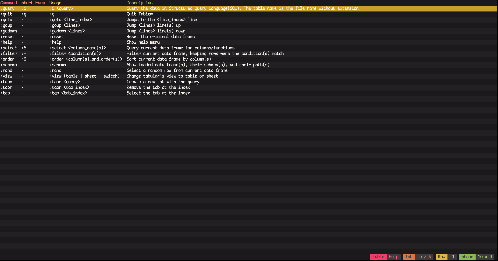

# Tabler Tutorial

Welcome to the Tabler tutorial—a guide to using this terminal-based tool for viewing and querying tabular files directly from the command line. Tabler enables efficient data manipulation and analysis across multiple formats, making it a valuable asset for professionals and enthusiasts in data-centric roles. This guide covers the core features and functionality to help you get the most out of Tabler.

This tutorial uses example CSV files located in the same directory as `tutorial.md`:

1. **housing.csv**: Housing price dataset.
2. **user.csv**: Dataset of users with properties generated by a Language Learning Model (LLM).
3. **company.csv**: Dataset of companies with properties generated by an LLM.
4. **employment.csv**: Relationship table between users and companies, showing employment history.

It's helpful to review these files to understand their structure and content.

## Opening Files

To open a file with Tabler, use:

```shell
tabler <file_name>
```

Replace `<file_name>` with the name of your file. For instance, to load the housing data:

```shell
tabler housing.csv
```

This command opens `housing.csv` and displays it in Tabler, with a status bar showing table properties such as name and dimensions.

### Supported Formats

Tabler supports various file types, including CSV, Parquet, JSON, JSON-Line, Arrow, and Fixed-Width Format (FWF). For example, to open a Parquet file:

```shell
tabler sample.parquet -f parquet
```

## Command Mode

Activate Command Mode by pressing `:`. Type a command and press `Enter` to execute or `Esc` to cancel. Commands appear at the bottom of the screen, replacing the status bar.

## Table Navigation

Navigate through data with these key mappings:

| Key                    | Action                |
| ---------------------- | --------------------- |
| `k` / `Arrow Up`       | Move up one row       |
| `j` / `Arrow Down`     | Move down one row     |
| `Page Up` / `Ctrl+b`   | Move up a page        |
| `Page Down` / `Ctrl+f` | Move down a page      |
| `Ctrl+u`               | Move up half a page   |
| `Ctrl+d`               | Move down half a page |
| `Home` / `g`           | Jump to first row     |
| `End` / `G`            | Jump to last row      |

To jump to a specific row, use the `:goto` command.

## Sheet View

In default table view, all rows display in a single line. For better readability, switch to **Sheet View** by pressing `v`. This mode shows each row individually and allows scrolling when rows exceed screen size.

To return to table view, press `q` or `v`.

## Multi-File Opening

To open multiple files at once, list them after the `tabler` command:

```shell
tabler housing.csv user.csv
```

This command opens each file in a separate tab. You can switch between tabs with `H` (previous tab) and `L` (next tab).

Use wildcards to open all files of a specific format in the directory:

```shell
tabler *.csv
```

## SQL Queries

Tabler supports SQL for powerful data manipulation. To run a query, use `:Q` or `:query`:

```sql
:Q SELECT * FROM housing WHERE price > 500000 AND mainroad = 'yes' AND bedrooms >= 4
```

To view results in a new tab, use `:tabn`:

```sql
:tabn SELECT * FROM user WHERE marriage='Married' AND balance < 10000
```

The table name corresponds to the file name (e.g., `housing.csv` becomes `housing`). If duplicate file names exist, suffixes (`_2`, `_3`, etc.) are added.

## Inline Queries

Inline queries enable quick manipulations on the active table. Commands include:

| Command          | Example                             | Description                     |
| ---------------- | ----------------------------------- | ------------------------------- |
| `:S` / `:select` | `:S price, area, bedrooms, parking` | Select specific columns         |
| `:F` / `:filter` | `:F price < 20000 AND bedrooms > 4` | Filter rows based on conditions |
| `:O` / `:order`  | `:O area`                           | Sort by a specific column       |

Chained commands on a table (e.g., `housing`) mirror a SQL equivalent.

## Exporting

Export data in various formats (CSV, TSV, Parquet, JSON, JSONL, Arrow) with:

```sql
:export <format> <path>
```

## Help Command

Use `:help` to view all commands and examples.


